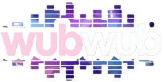
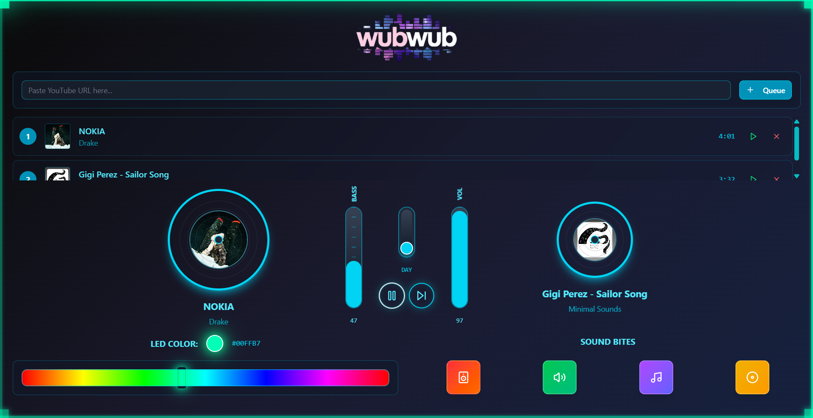
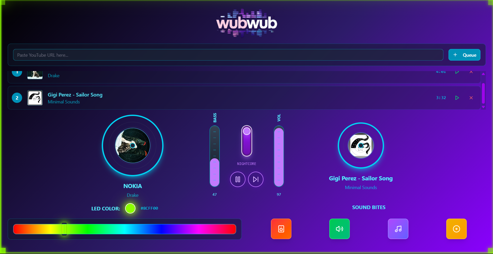
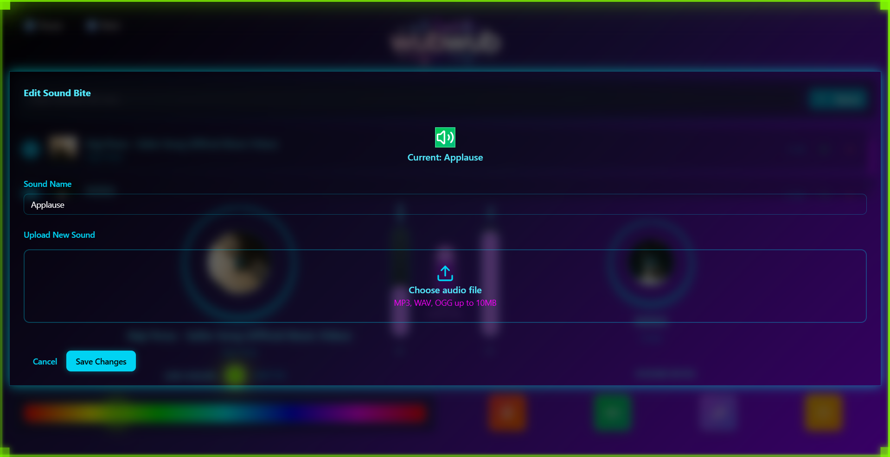
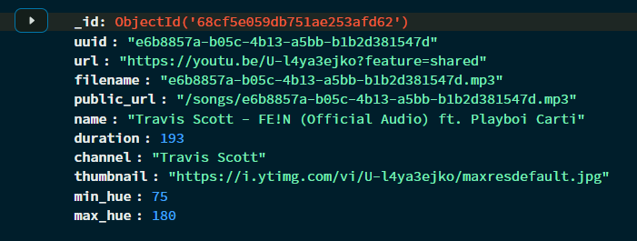
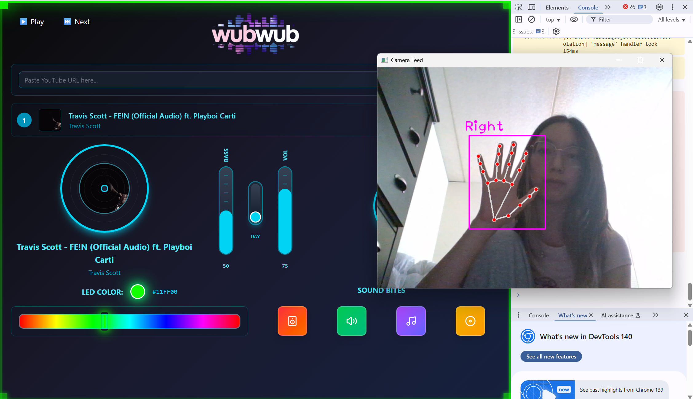

<!-- PROJECT LOGO -->
 

    

  

    Anyone can be a DJ!
     
    <a href="https://devpost.com/software/wubwub"><strong>Devpost »</strong></a>
     
     
    <a href="https://www.linkedin.com/in/cindy-li-569a30187/">Cindy Li</a>
    ·
    <a href="https://www.linkedin.com/in/2023cyang/">Cindy Yang</a>
    ·
    <a href="https://www.linkedin.com/in/elise-yz/">Elise Zhu</a>
  

<!-- TABLE OF CONTENTS -->

  
Table of Contents

  <ol>
    <li>
      <a href="#about-the-project">About The Project</a>
      <ul>
        <li><a href="#built-with">Built With</a></li>
      </ul>
    </li>
    <li>
      <a href="#technologies">Technologies</a>
      <ul>
        <li><a href="#mongodb">MongoDB</a></li>
        <li><a href="#gemini">Gemini</a></li>
        <li><a href="#web">Web Audio API</a></li>
        <li><a href="#mediapipe">Mediapipe and OpenCV</a></li>
        <li><a href="#youtube">Youtube DLP</a></li>
        <li><a href="#arduino">Arduino and Adafruit</a></li>
        <li><a href="#multithreading">Sockets and Multithreading</a></li>
        <li><a href="#tailwind">Figma and Tailwind</a></li>
        <li><a href="#vite">Vite and React</a></li>
        <li><a href="#flask">Flask</a></li>
      </ul>
    </li>
    <li><a href="#contact">Contact</a></li>
    <li><a href="#acknowledgments">Acknowledgments</a></li>
  </ol>

<!-- ABOUT THE PROJECT -->
## About The Project

wubwub is a web-based, gesture-controlled music mixing interface that brings the energy of a DJ setup straight into the browser. Built with computer vision, no keyboard or mouse is required. Every control is fully responsive to hand movements!

**Features**

- Dual Spinning CDs – Showcases album art for the current and upcoming songs.
- Gesture-Controlled Sliders – Adjust bass boost and volume with vertical hand movements.
- Nightcore Switch – Triggerable by gesture, this not only alters playback but also transforms the site’s theme (day ↔ night) in neon DJ style.

- Dynamic Song Queue – Paste YouTube links to add tracks to the queue on the fly.
- Sound Bites – Quick-trigger sound effect buttons for live mixing, editable through a pop-up menu.

- LED Visualizer – A color bar displays dynamic LED color matching the mood of the song, with synced flashing along the border of the interface.

### Built With

[![MongoDB][MongoDB]][MongoDB-url]
[![Gemini][Gemini]][Gemini-url]
[![Web Audio API][Web Audio API]][web-url]
[![Mediapipe][Mediapipe]][Mediapipe-url]
[![OpenCV][OpenCV]][OpenCV-url]
[![Youtube DLP][Youtube DLP]][youtube-url]
[![Arduino][Arduino]][arduino-url]
[![Adafruit][Adafruit]][adafruit-url]
[![Python][Python]][Python-url]
[![Figma][Figma]][Figma-url]
[![Tailwind][Tailwind]][Tailwind-url]
[![Vite][Vite]][Vite-url]
[![Flask][Flask]][Flask-url]

(<a href="#readme-top">back to top</a>)

<!-- GETTING STARTED -->
## Technologies

### MongoDB

MongoDB stores the active song queue, sound bite configurations, and user session data. It allows the system to persist state across reloads and ensures seamless queue management when multiple tracks are added.

### Gemini

Gemini is used to enrich the music experience by generating color hues that match the mood of each song. These hues are displayed on both the website and LED strip and flash to the beat!

### Web Audio API

The Web Audio API is a low-level audio processing interface built into modern browsers. Instead of just playing audio files, it exposes a graph-based system of audio nodes that can be connected, modified, and rerouted in real time. 

In our project, audio streams from YouTube-DLP are fed into AudioContext nodes, where we apply effects like biquad filters for bass boosting, playback rate adjustments for Nightcore, and gain nodes for volume control. Because the API runs natively in the browser, these transformations are highly performant and sample-accurate, giving us professional-grade sound manipulation without external software.

### Mediapipe and OpenCV

Mediapipe provides a pretrained, GPU-optimized pipeline for tracking hand landmarks in real time (21 key points per hand). Under the hood, it uses deep learning models to estimate 3D positions of these landmarks from a webcam feed. We use these points to detect gestures. For example, vertical hand movement mapped to volume, or a toggle gesture mapped to the Nightcore switch.

Meanwhile, OpenCV handles lower-level video stream preprocessing (frame capture, smoothing, thresholding). Mediapipe alone can track landmarks, but OpenCV gives us fine control to stabilize and clean the input data. Together, they provide a fast, accurate gesture recognition system that works entirely on consumer webcams.

### Youtube DLP

YouTube-DLP is a Python-based tool that bypasses YouTube’s standard playback UI to fetch the direct media streams and metadata. Behind the hood, it parses YouTube’s page structure, extracts the dynamic streaming manifests (DASH/HLS), and resolves the highest-quality audio link. 

We use this to retrieve audio in a format directly consumable by the Web Audio API, along with thumbnails/metadata for the spinning CD visuals. Since fetching and parsing manifests can take time, we threaded this process so the user doesn’t experience UI freezes while adding new tracks.

### Arduino and Adafruit

Arduino drives connected Adafruit hardware to sync the digital experience with the physical world. LED strips update in real-time with the color visualizer, bringing the board’s energy into a live glowing border. This is communicated through serial instructions from the python server.

### Sockets and Multithreading

Instead of having the front end constantly poll a REST API for updates (which is inefficient and introduces latency), we used WebSockets to push gesture recognition results directly from the CV backend to the React interface. This gives near real-time responsiveness — the moment a hand moves, the slider updates.

We also applied multithreading in the backend: YouTube-DLP runs in its own thread so video metadata extraction and audio URL resolution don’t block the main Flask event loop. This ensures that gesture control and LED updates remain smooth while new songs are loading in parallel.

### Figma and Tailwind

Figma was used to design the UI with an emphasis on neon, futuristic DJ vibes. Tailwind CSS translated those designs into a clean, responsive, and customizable interface that feels both modern and immersive.

### Vite & React

React powers the interactive UI — from the dual spinning CDs to the live queue and sound bite grid. Vite makes development fast and efficient with hot reloading and optimized builds for smooth browser performance.

### Flask

Flask serves as the project’s backend framework, connecting all the pieces together. It manages the API endpoints, handles YouTube-DLP calls, talks to MongoDB, and coordinates real-time communication with the front end and hardware.

<!-- CONTACT -->
## Contact

Cindy Li (audio processing, hardware, youtube extraction) - cl2674@cornell.edu

Cindy Yang (design, mongodb, hardware, gemini, threading) - cwyang@umich.edu

Elise Zhu (gesture recognition, sockets, sound bites) - eyz7@georgetown.edu

<!-- MARKDOWN LINKS & IMAGES -->
<!-- https://www.markdownguide.org/basic-syntax/#reference-style-links -->
[MongoDB]: https://img.shields.io/badge/MongoDB-47A248?style=for-the-badge&logo=MongoDB&logoColor=white
[MongoDB-url]: https://www.mongodb.com/
[Gemini]: https://img.shields.io/badge/Gemini-8E75B2?style=for-the-badge&logo=GoogleGemini&logoColor=white
[Gemini-url]: https://aistudio.google.com/
[Web Audio API]: https://img.shields.io/badge/WebAudioAPI-000000?style=for-the-badge&logo=mdnwebdocs&logoColor=white
[web-url]: https://developer.mozilla.org/en-US/docs/Web/API/Web_Audio_API
[OpenCV]: https://img.shields.io/badge/opencv-5C3EE8?style=for-the-badge&logo=opencv&logoColor=white
[OpenCV-url]: https://opencv.org/
[Mediapipe]: https://img.shields.io/badge/mediapipe-0097A7?style=for-the-badge&logo=mediapipe&logoColor=white
[Mediapipe-url]: https://github.com/google-ai-edge/mediapipe
[Youtube DLP]: https://img.shields.io/badge/youtubedlp-FF0000?style=for-the-badge&logo=youtube&logoColor=white
[youtube-url]: https://github.com/yt-dlp/yt-dlp
[Arduino]: https://img.shields.io/badge/arduino-00878F?style=for-the-badge&logo=arduino&logoColor=white
[arduino-url]: https://www.arduino.cc/
[Adafruit]: https://img.shields.io/badge/adafruit-000000?style=for-the-badge&logo=adafruit&logoColor=white
[adafruit-url]: https://learn.adafruit.com/
[Python]: https://img.shields.io/badge/Python-3776AB?style=for-the-badge&logo=python&logoColor=white
[Python-url]: https://www.python.org/
[Figma]: https://img.shields.io/badge/figma-F24E1E?style=for-the-badge&logo=figma&logoColor=white
[Figma-url]:https://www.figma.com/
[Vite]: https://img.shields.io/badge/vite-646CFF?style=for-the-badge&logo=vite&logoColor=white
[Vite-url]:https://vite.dev/
[Tailwind]: https://img.shields.io/badge/TailwindCSS-06B6D4?style=for-the-badge&logo=Tailwind-CSS&logoColor=white
[Tailwind-url]: https://tailwindcss.com/
[Flask]: https://img.shields.io/badge/flask-3BABC3?style=for-the-badge&logo=flask&logoColor=white
[Flask-url]: https://flask.palletsprojects.com/en/stable/
